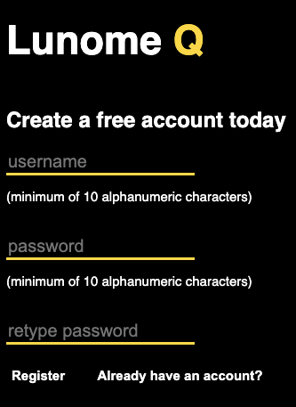

# Lunome Q
## A basic banking application (under construction)

Link to website: https://holmesmainsend.github.io/banking_application/

  ## Table of Contents
  * [Description](#description)
  * [Video Walkthrough](#video-walkthrough)
  * [Future Improvements](#future-improvements)
  * [License](#license)
  * [Questions?](#questions)

## Description
  A banking application demonstrating one potential implementation of hash algorithms and symmetric key
  cryptography. This app is not cryptographically secure, and in its present state is vulnerable to many different types of attacks.

  The website's name derives firstly from an early pioneer of hash coding, Hans Peter Luhn. Luhn also invented a device for textile thread-counts termed a Lunometer. Since I have an interest in both computer science and textiles, it seemed fitting to name the website in honor of this joint dual-interest of ours, abbreviating the term to "Lunome" (source for information: https://en.wikipedia.org/wiki/Hans_Peter_Luhn).

  As for the "Q" portion of the website, it refers to the implementation of the Queue abstract data type (ADT) within this application. Specifically, the Queue takes the form of a Linear-feedback shift register (LFSR) used for the generation of each user's session key.

## Video Walkthrough
https://www.youtube.com/watch?v=a6bcuLqFwEM

## Future Improvements
  The list of potential improvements to this app is limitless. Some positive changes would include:
  * Moving all the major security algorithms (salting, hashing, session key generation) to a separate Java layer and keeping them private
  * Finishing the new user creation function(s)
  * Adding a SQL database layer for user credentials, balances, etc.
  * Enforcing stricter password/username requirements
  * Creating separate admin/server dashboard
  * Expanding user dashboard to include budget tab, chart of expenditures over time, and more
  * Implement a responsive page layout for devices of all shapes and sizes
    

## License
  Click the badge at the top of this README for more information on this particular license.

## Questions?
  * GitHub: https://github.com/holmesmainsend
  * LinkedIn: https://www.linkedin.com/in/sean-holmesmainsend/